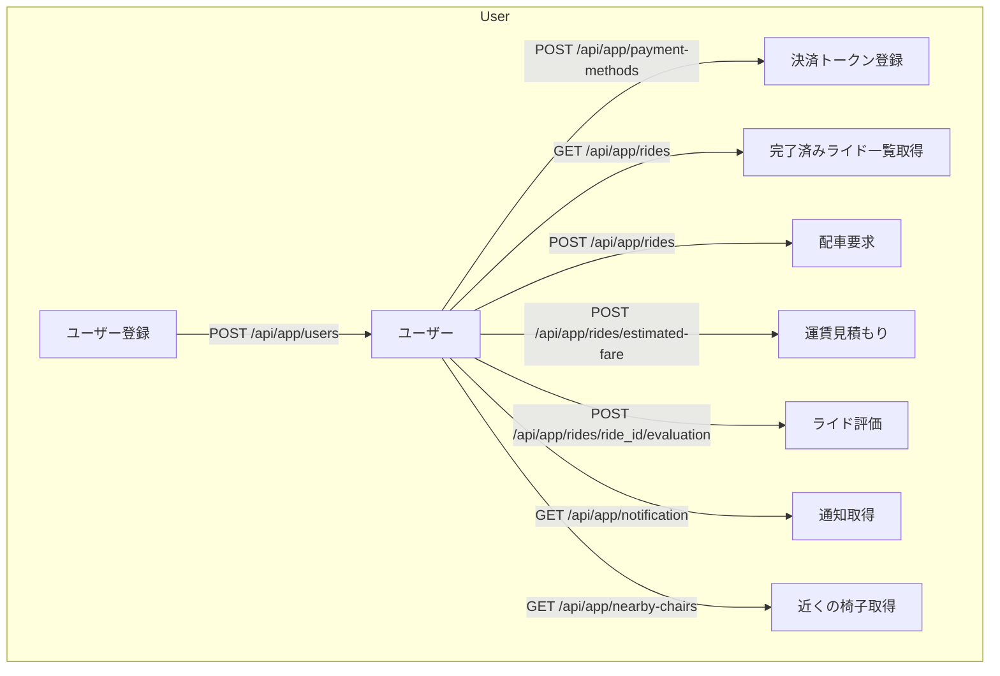
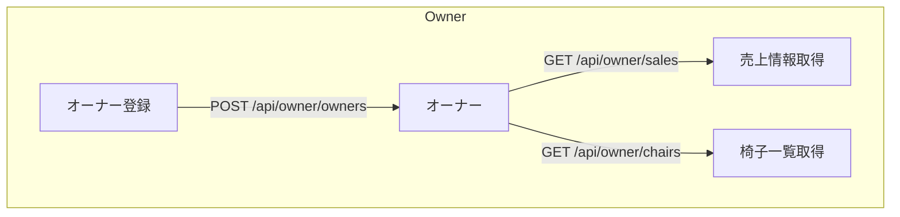
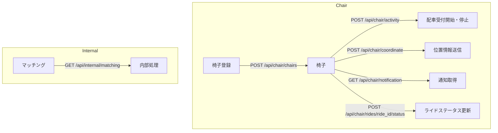

### app handlers
- **POST /api/app/users**
  - ユーザー登録を行うエンドポイント。
  - 招待コードを用いて登録した場合は、招待クーポンを付与する。

- **POST /api/app/payment-methods**
  - 決済トークンの登録を行うエンドポイント。
  - 認証が必要。

- **GET /api/app/rides**
  - ユーザーが完了済みのライド一覧を取得するエンドポイント。
  - 認証が必要。

- **POST /api/app/rides**
  - ユーザーが配車を要求するエンドポイント。
  - クーポンを所有している場合、自動で利用する。
  - 認証が必要。

- **POST /api/app/rides/estimated-fare**
  - ライドの運賃を見積もるエンドポイント。
  - 認証が必要。

- **POST /api/app/rides/ride_id/evaluation**
  - ユーザーがライドを評価するエンドポイント。
  - 認証が必要。

- **GET /api/app/notification**
  - ユーザー向け通知エンドポイント。
  - 認証が必要。

- **GET /api/app/nearby-chairs**
  - ユーザーの近くにいる椅子を取得するエンドポイント。
  - 認証が必要。

### owner handlers
- **POST /api/owner/owners**
  - 椅子のオーナーが会員登録を行うエンドポイント。

- **GET /api/owner/sales**
  - 椅子のオーナーが指定期間の全体・椅子ごと・モデルごとの売上情報を取得するエンドポイント。
  - 認証が必要。

- **GET /api/owner/chairs**
  - 椅子のオーナーが管理している椅子の一覧を取得するエンドポイント。
  - 認証が必要。

### chair handlers
- **POST /api/chair/chairs**
  - 椅子の登録を行うエンドポイント。

- **POST /api/chair/activity**
  - 椅子が配車受付を開始・停止するエンドポイント。
  - 認証が必要。

- **POST /api/chair/coordinate**
  - 椅子が自身の位置情報を送信するエンドポイント。
  - 認証が必要。

- **GET /api/chair/notification**
  - 椅子向け通知エンドポイント。
  - 認証が必要。

- **POST /api/chair/rides/ride_id/status**
  - 椅子がライドのステータスを更新するエンドポイント。
  - 認証が必要。

### internal handlers
- **GET /api/internal/matching**
  - ライドのマッチングを行うエンドポイント。
  - 内部からのみアクセス可能。

